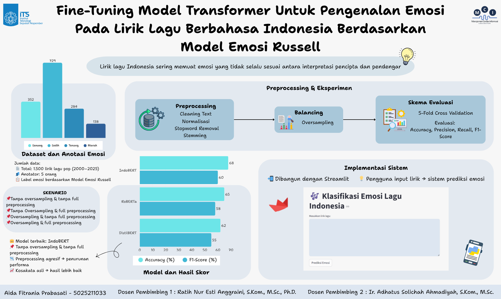
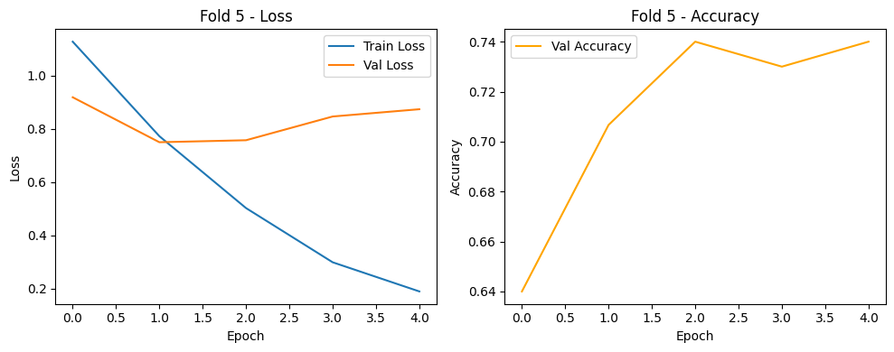

# 🏁 Tugas Akhir (TA) - Final Project

**Nama Mahasiswa**: Aida Fitrania Prabasati  
**NRP**: 5025211033  
**Judul TA**: Fine-Tuning Model Transformer untuk Pengenalan Emosi pada Lirik Lagu Berbahasa Indonesia Berdasarkan Model Emosi Russell  
**Dosen Pembimbing**: Ratih Nur Esti Anggraini, S.Kom., M.Sc., Ph.D.  
**Dosen Ko-pembimbing**: Ir. Adhatus Solichah Ahmadiyah, S.Kom., M.Sc.

---

## 📺 Demo Aplikasi  

[](https://www.youtube.com/watch?v=seicLEdF4MU)  
*Klik gambar di atas untuk menonton demo*

---

## 📚 Tentang Tugas Akhir

Tugas Akhir ini bertujuan untuk mengeksplorasi dan membandingkan performa tiga model transformer yaitu IndoBERT, RoBERTa, dan DistilBERT dalam tugas klasifikasi emosi pada lirik lagu berbahasa Indonesia. Emosi dikategorikan berdasarkan Model Emosi Russell ke dalam empat kelas: senang, sedih, tenang, dan marah.  

Untuk mengetahui pengaruh preprocessing dan penyeimbangan data, dilakukan fine-tuning ketiga model menggunakan empat skenario berbeda, yaitu:  
1. Tanpa Oversampling & Full Preprocessing  
2. Tanpa Oversampling & Tanpa Full Preprocessing ( Tanpa Stopword Removal & Stemming )
3. Oversampling & Full Preprocessing
4. Oversampling & Tanpa Full Preprocessing ( Tanpa Stopword Removal & Stemming )

Proses penelitian ini mencakup beberapa tahap utama:  


1. Pengumpulan dan anotasi dataset sebanyak 1.500 lirik lagu pop Indonesia (tahun 2000–2025)
  
  |              Judul Lagu                 | Penyanyi      | Genre     |           Lirik Lagu ( Penggalang Lirik )                          | Tahun Rilis | Label Emosi |
  |-----------------------------------------|---------------|-----------|--------------------------------------------------------------------|-------------|-------------|
  |Bagaimana Kalau Aku Tidak Baik Baik Saja | Judika        | Pop       | “Andai aku bisa memutar waktu<br>Aku tak ingin mengenalmu....”     |     2021    |    Sedih    |
  |Tak Ada Ujungnya                         | Rony Parulian | Pop       | “Ku temukan satu sisi dalam diri<br>Warna warni penuhi jiwaku....” |     2024    |   Senang    |
  |Semua Aku Dirayakan                      | Nadin Amizah  | Pop, Folk | “Terima kasih, katanya<br>Semua aku dirayakan...."                 |     2023    |   Tenang    |
  |Penipu Hati                              | Tata Janeeta  | Pop       | "Kau katakan kau tak ingin<br>Membagi hatimu....."                 |     2014    |    Marah    |
  |               ...                       |    ...        |   ...     |                         ...                                        |    ...      |    ...      |                                                          
                                                                  
  
3. Preprocessing, termasuk pembersihan, normalisasi, stopword removal, dan stemming
4. Balancing data menggunakan metode oversampling ( Random Over Sampling )
5. Fine-tuning model transformer
6. Evaluasi performa model menggunakan 5-Fold Cross Validation dan metrik accuracy, precision, recall, dan F1-score

---

## 🛠 Panduan Fine-Tuning dan Menjalankan Sistem Prediksi Emosi  

### Langkah-langkah 
#### Fine-Tuning Model
1. **Clone Repository**  
   ```bash
   git clone https://github.com/Informatics-ITS/ta-aidafitraniaa.git
   ```
   Pada penelitian ini peneliti menggunakan Google Colab untuk fine-tuning model  
2. **Persiapan**
   - Persiapkan dataset yang sudah diunduh dan tempatkan ke dalam direktori sesuai kebutuhan
   - Agar lebih mudah tempatkan dataset di dalam direktori yang sama dengan file code tiap model
   - Buat folder masing-masing untuk tiap model per skenarionya, untuk menyimpan hasil dari keseluruhan fine-tuning dan lainnya
   - Pada file code di setiap model nya, sesuaikan path untuk memanggil dataset, menyimpan hasil, dan memanggil hasil dari tiap proses
5. **Jalankan Aplikasi**
   - Jalankan file code dari tiap model
   - Pastikan menjalankan semua cell code `install` yang ada agar tidak terjadi error
   - Hasil setiap proses akan muncul di bawah setiap code cell
6. **Simpan Model Terbaik**
   - Setelah menjalankan semua skenario di tiap model, tentukan 1 model dengan skenario yang memiliki hasil yang terbaik (f1-score atau accuracy)
   - Jalankan file code di model dan skenario tersebut dan pastikan pada akhir cell code fine-tuning menambahkan code untuk menyimpan model berdasarkan f1-score atau accuracy terbaik pada salah satu fold
   - Pastikan setelah menjalankan file code ulang, folder berisi `model.safetensor`, `config`, `special_tokens_map`, `tokenizer_config`, `tokenizer`, dan `vocab` sudah tersimpan

#### Sistem Prediksi Sistem
1. **Persiapan**
   - Pastikan sudah mengunduh folder berisi hasil model terbaik
   - Unduh file python `streamlit_app.py` untuk menjalankan sistem berbasis streamlit
   - Tempatkan folder model terbaik dan file pyhton streamlit pada direktori yang sama
3. **Jalankan Sistem**
   - Buka terminal pada direktori berisi model terbaik dan file python streamlit
   - Install streamlit terlebih dahulu
     ```bash
     pip install streamlit
     ```
   - Jalankan file python `streamlit_app.py` pada terminal
     ```bash
     streamlit run streamlit_app.py
     ```
     Akan diarahkan langsung menuju localhost streamlit sistem kita
     Jika tidak ada, bisa klik manual link yang muncul di terminal

---

## 📚 Hasil Model dengan Skenario Terbaik dan Preview Sistem Prediksi Emosi

### IndoBERT dengan Skenario 2 (Tanpa Oversampling dan Tanpa Full Preprocessing)

| Accuracy (%) | Precision (%) | Recall (%) | F1-Score (%) |
|--------------|---------------|------------|--------------|
|     68       |      63       |     59     |      60      |

Grafik Accuracy dan Loss Fold 5 (Hasil Terbaik)



Confusion Matrix Fold 5 (Hasil Terbaik)


### Sistem Prediksi Emosi

Tampilan Awal


Tampilan Peringatan Input Lirik Lagu


Tampilan Hasil Prediksi Emosi Lirik Lagu


---

## ⁉️ Pertanyaan?

Hubungi:
- Penulis: [fitraniap78@gmail.com]
- Pembimbing Utama: [ratih@its.ac.id]
